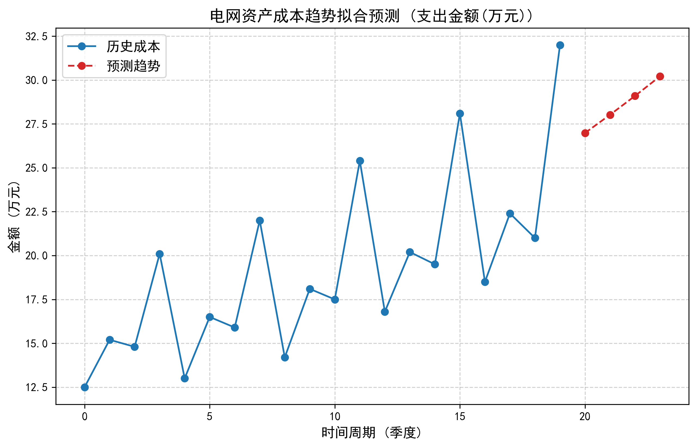

# ⚡ 电网资产全生命周期成本评估报告

**生成时间：** 2026-02-23 14:40:59

---

## 1. 资产历史与未来成本预测

系统成功解析了 **20** 条历史台账记录，并采用二项式回归模型进行了非线性拟合。未来 4 个周期的预计运维成本如下：

- **T+1 周期**: 预计支出 **26.98** 万元
- **T+2 周期**: 预计支出 **28.02** 万元
- **T+3 周期**: 预计支出 **29.10** 万元
- **T+4 周期**: 预计支出 **30.22** 万元

*(注：上图由 Scikit-Learn 后台自动化生成)*

## 2. 关键合同与现场工单审计汇总

本次分析共通过多模态大模型从 Word、PDF、TXT 以及图片扫描件中成功提取并校验了 **3** 份外部文件。关键财务信息如下：

| 项目名称 | 合同/工单编号 | 提取总金额 (元) | 签署日期 |
| :--- | :--- | :--- | :--- |
| 2024年度电网设备资产更新协议 | SG-2024-088 | **¥ 1,250,000.00** | 2024-03-15 |
| 2025年城网改造高压电缆入地工程 | WORD-2025-001 | **¥ 3,500,000.00** | 2025-01-20 |
| 变电站-检修维护(工单) | REP-2024-992 | **¥ 45,000.00** | 2024-05-12 |

---
*报告由 GALCA (Grid Asset Lifecycle Cost Agents) 自动生成。*